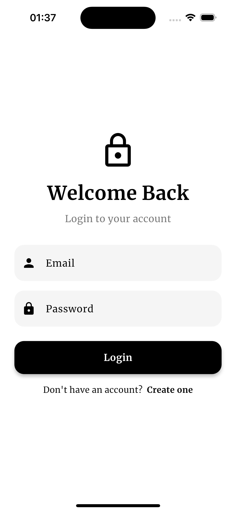
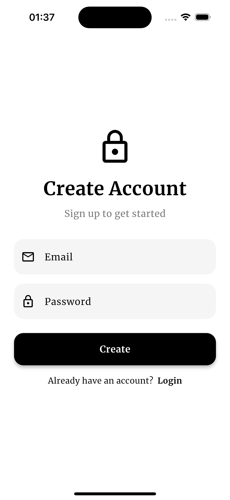
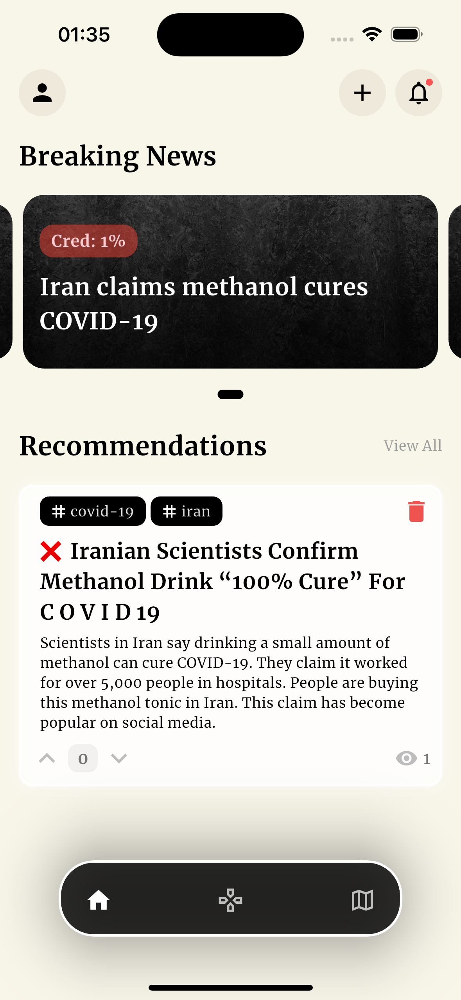
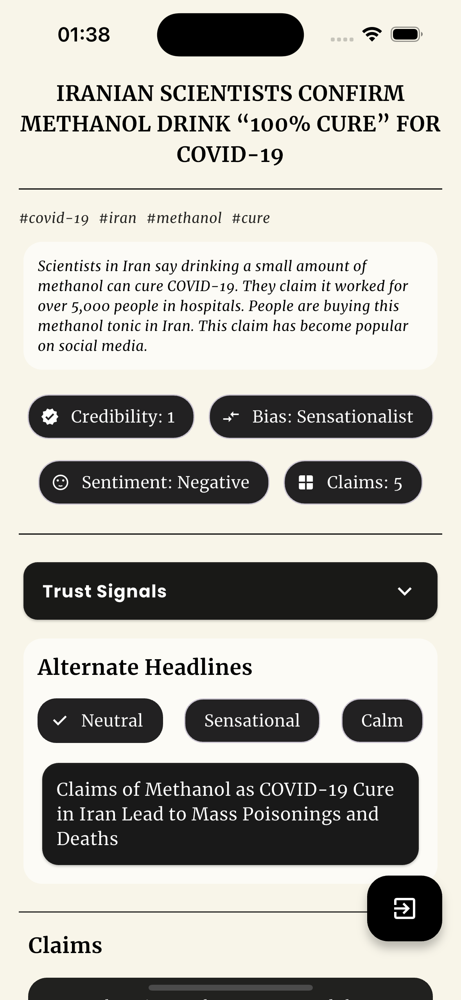
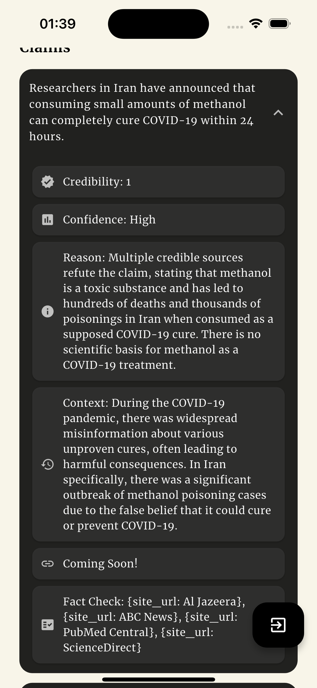
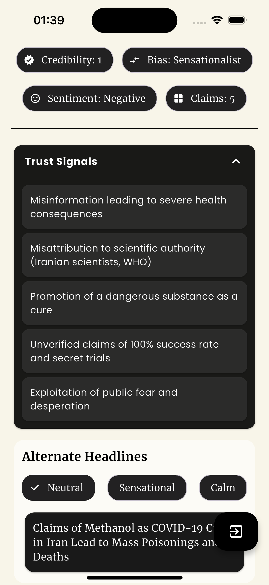
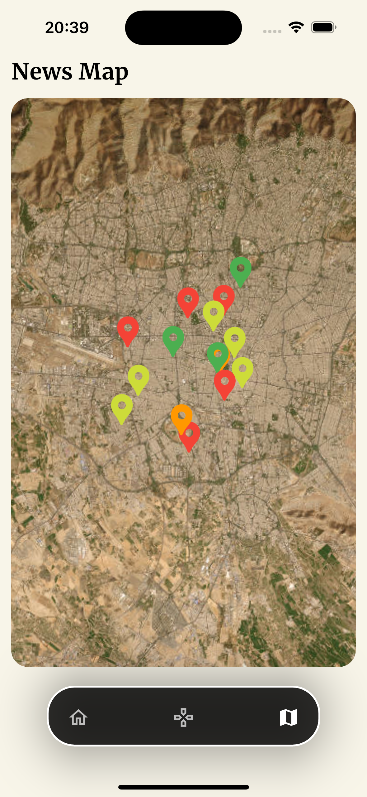
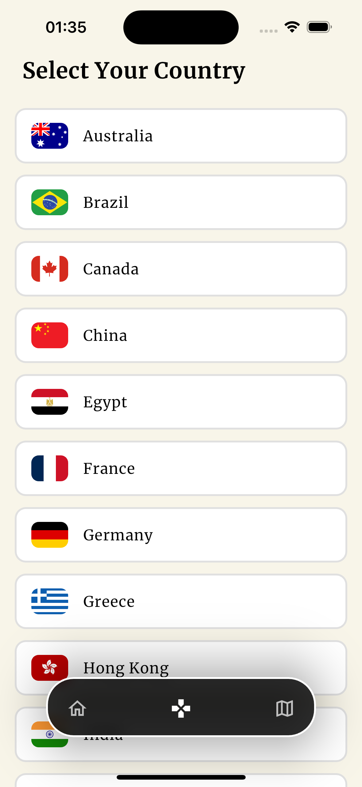

# Factline

Factline is a Flutter application designed to help users critically evaluate news articles and other information sources. It offers detailed analysis, including credibility scores, bias detection, and claim verification, to promote media literacy and combat misinformation.

## Features

* **Article Analysis**: Get in-depth analysis of news articles, including credibility scores, bias detection, and sentiment analysis.
* **Claim Verification**: Factline breaks down articles into individual claims and provides verification, historical context, and links to relevant sources.
* **Alternative Headlines**: See alternative headlines for the same news story, offering neutral, sensational, and calm perspectives.
* **News Map**: Explore a map view of news articles, visualized by their credibility scores.
* **Fake News Game**: Test your media literacy skills with a fun game that challenges you to distinguish between real and fake news headlines.

## Screenshots

| Login | Create Account | Home | News Details |
| :---: | :---: | :---: |:---:|
|  |  |  ||

| Claims | Trust Signals | Map | Game |
| :---: | :---: |:---:|:---:|
|  |  || |

## Getting Started

### Prerequisites

* Flutter SDK: [Install Flutter](https://flutter.dev/docs/get-started/install)
* Dart SDK: Included with Flutter

### Installation

1.  Clone the repo
    ```sh
    git clone [https://github.com/pratyakshkwatra/factline_frontend.git](https://github.com/pratyakshkwatra/factline_frontend.git)
    ```
2.  Install packages
    ```sh
    flutter pub get
    ```
3.  Run the app
    ```sh
    flutter run
    ```

## Built With

* [Flutter](https://flutter.dev/) - The UI toolkit for building beautiful, natively compiled applications for mobile, web, and desktop from a single codebase.
* [Dart](https://dart.dev/) - The programming language used for Flutter development.
* [Dio](https://pub.dev/packages/dio) - A powerful HTTP client for Dart.
* [AutoRoute](https://pub.dev/packages/auto_route) - A Flutter navigation package that helps with routing and passing arguments between screens.
* [Google Fonts](https://pub.dev/packages/google_fonts) - A Flutter package to use fonts from fonts.google.com.
* [Flutter Secure Storage](https://pub.dev/packages/flutter_secure_storage) - A Flutter plugin to store data in secure storage.
* [Flutter Map](https://pub.dev/packages/flutter_map) - A versatile mapping package for Flutter.